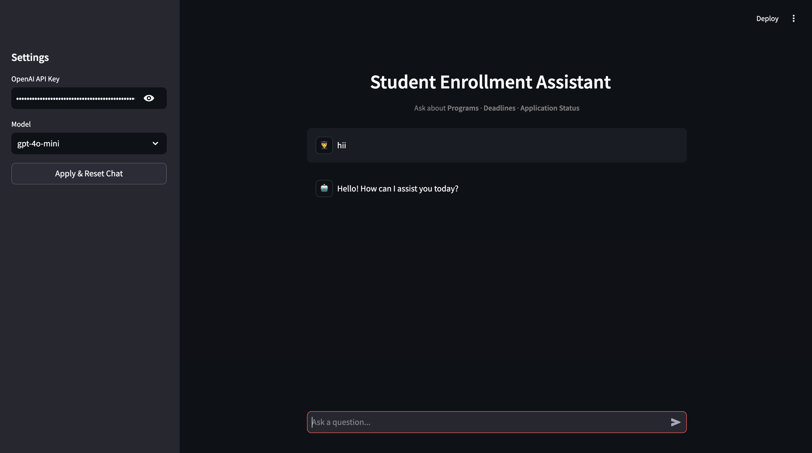

# Student Enrollment Assistant Agent

A conversational AI agent for a university's admissions office built with **LangChain**, **LangGraph**, and **OpenAI**. The agent helps prospective students get answers about programs, deadlines, and application status using tool-calling (ReAct pattern).

## Project Structure

```
EDMO/
├── main.py                          # CLI entry point — runs 5-turn test conversation
├── app.py                           # Streamlit UI
├── requirements.txt                 # Python dependencies
├── .env                             # Environment variables (API key, model name)
├── output.md                        # Test conversation output log
├── README.md
└── src/
    ├── __init__.py
    ├── agent/
    │   ├── __init__.py
    │   └── enrollment_agent.py      # StudentEnrollmentAgent class (create_agent)
    └── tools/
        ├── __init__.py
        ├── mock_data.py             # Hardcoded mock data (programs, applicants, deadlines)
        └── enrollment_tools.py      # Tool definitions (get_program_info, check_application_status, get_deadlines)
```

## Tech Stack

- **Python 3.12+**
- **LangChain** — agent framework (`create_agent`)
- **LangGraph** — agent runtime with `InMemorySaver` for conversation memory
- **OpenAI GPT-4o-mini** — LLM for reasoning and tool-calling
- **Streamlit** — web-based chat UI
- **python-dotenv** — environment variable management

## Tools

| Tool | Input | Returns |
|------|-------|---------|
| `get_program_info` | `program_name: str` | Program name, duration, tuition, prerequisites |
| `check_application_status` | `applicant_id: str` | Applicant name, program, status, next step |
| `get_deadlines` | `program_name: str` | Application deadline, document deadline, decision date |

## Mock Data

**Programs:** Computer Science, Data Science, Business Administration

**Applicants:**
| ID | Name | Program | Status |
|----|------|---------|--------|
| APP-1042 | Alice Johnson | Computer Science | Documents Pending |
| APP-2085 | Bob Smith | Data Science | Under Review |
| APP-3071 | Carol Davis | Business Administration | Accepted |

## Setup & Installation

### 1. Clone the repository

```bash
cd EDMO
```

### 2. Create virtual environment

```bash
python3 -m venv venv
source venv/bin/activate
```

### 3. Install dependencies

```bash
pip install -r requirements.txt
```

### 4. Configure environment variables

Edit the `.env` file and add your OpenAI API key:

```
OPENAI_API_KEY=your-openai-api-key-here
MODEL_NAME=gpt-4o-mini
```

## How to Run

### Option 1: CLI (Test Conversation)

Runs the 5-turn test conversation and prints the full input/output log.

```bash
source venv/bin/activate
python main.py
```

### Option 2: Streamlit UI

Launches a web-based chat interface in your browser.

```bash
source venv/bin/activate
streamlit run app.py
```

- Enter your OpenAI API key in the sidebar (or it reads from `.env`)
- Select a model from the dropdown
- Start chatting with the assistant

## Screenshot



## Agent Architecture

The agent uses LangChain's `create_agent` which implements the **ReAct (Reasoning + Acting)** pattern:

```
User Message → LLM Reasoning → Tool Call (if needed) → Tool Result → LLM Response
```

1. **Receive** user message
2. **Reason** about which tool(s) to call
3. **Execute** the tool(s) and observe results
4. **Respond** with a natural language answer
5. **Repeat** — conversation history is maintained via `InMemorySaver`

### Key Features

- **Multi-turn context** — remembers program names and applicant IDs across turns
- **Graceful escalation** — redirects to enrollment counselor for out-of-scope questions
- **Tool-based answers** — always uses tools for data, never relies on LLM knowledge

## Test Conversation

See [output.md](output.md) for the full 5-turn test conversation log.
